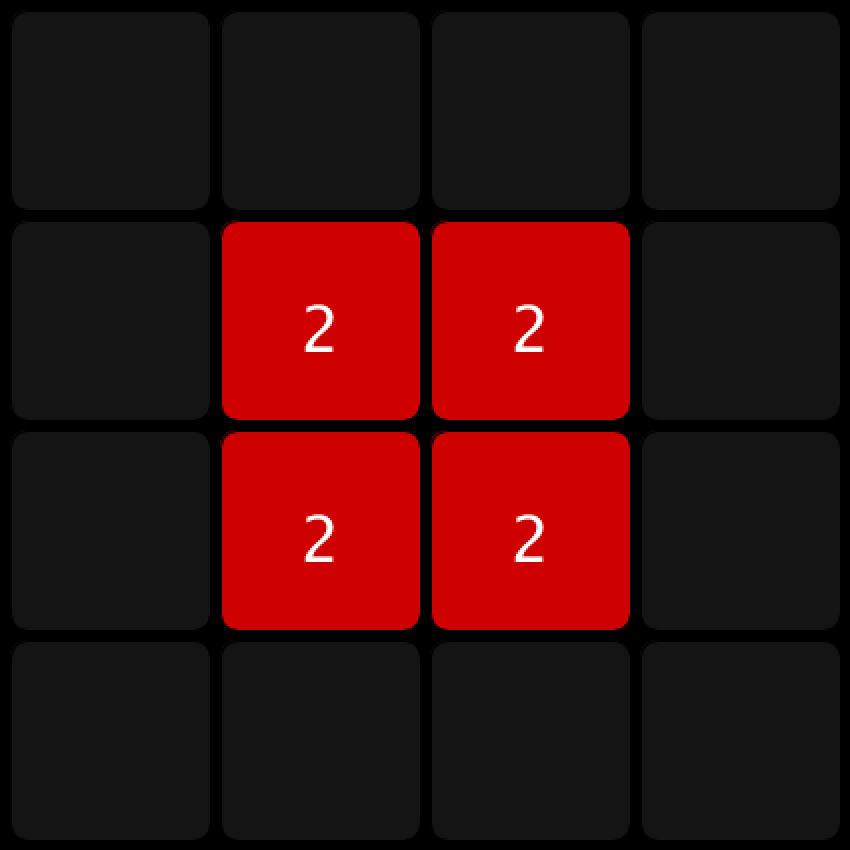

# how does 2048 work even?

I had a spare few hours and wanted to know how [2048](https://gabrielecirulli.github.io/2048/) worked, so I built it.  (Badly.)

I built it in [Processing](https://processing.org/) because it's easy-peasy to do small things quickly.

------------------------

It looks like this:

And futzing with some magic numbers in the code can make it playable on a much bigger grid:

(^That's not in the downloadable executables, sorry. Create a GitHub Issue if you want that.)

------------------------

If for some silly reason you want to play it, here download the executable for your platform:
- [osx](https://github.com/kdbanman/how_does_2048_work_even/raw/master/assets/executables/application.macosx.zip)
- [linux32](https://github.com/kdbanman/how_does_2048_work_even/raw/master/assets/executables/application.linux32.zip)
- [linux64](https://github.com/kdbanman/how_does_2048_work_even/raw/master/assets/executables/application.linux64.zip)
- [windows32](https://github.com/kdbanman/how_does_2048_work_even/raw/master/assets/executables/application.windows32.zip)
- [windows64](https://github.com/kdbanman/how_does_2048_work_even/raw/master/assets/executables/application.windows64.zip)

You'll need Java 7.

